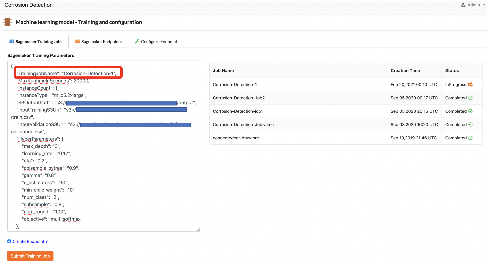
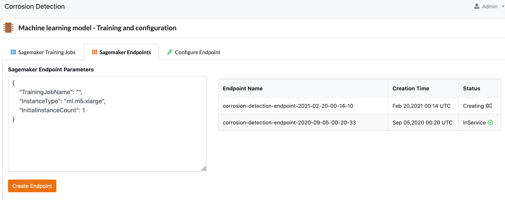
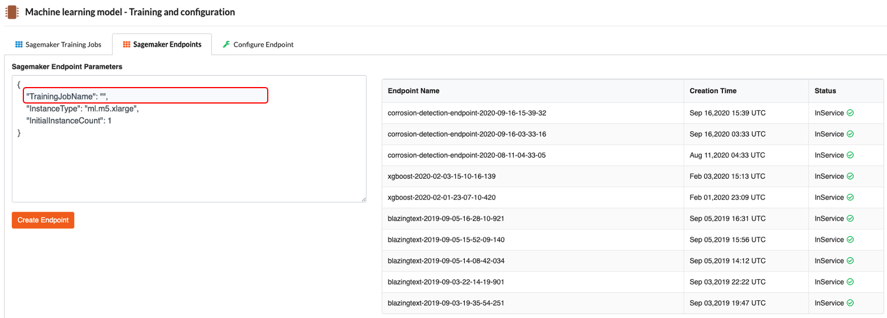
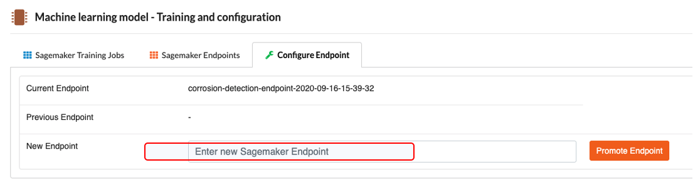

# Detecting Metal Corrosion with Machine Learning on AWS

This React based Web application lets you detect corrosion using Machine Learning models
created with Amazon SageMaker. 

# Overview of components
This application consists of many components:
1. `API` - Contains code for the Api. Uses the AWS chalice framework.
2. `DDB` - contains the CloudFormation template for creating DynamoDB tables.
3. `s3-Lambda` - contains code for Lambda functions which are configured as a S3 Trigger and Cloudformation template for creating these resources.
4. `StepFunctions` - contains source code for Lambda functions used in Step functions workflow. Also includes Cloudformation template to create step functions.
5. `WebApp` - contains React web application code.

# Prerequisites
1. Install NodeJS version 10.20.1
2. AWS CLI
3. AWS SAM CLI
4. Python 3.6
5. AWS Chalice
6. Create a new React App by referring the steps outlined at https://reactjs.org/docs/create-a-new-react-app.html and add the React source code found in the WebApp folder to the newly created React App.

# Deployment Steps

In order to deploy the solution, clone this repo and run
the following command in your terminal. The command takes an Email ID as a parameter. An email wil be set with Login credentials for the React Web Application.

```
./deploy.sh EMAIL_ID
```

Once the deployment is complete, copy the CloudFront URL displayed in your terminal and open it in a Browser.

## Training the model with Amazon SageMaker

Follow these steps to Train a new model

1. Login to the Web App and navigate to the menu option **Model Training**
2. In the JSON parameter payload displayed under  **SageMaker Training Parameters**,
provide a **unique name** for the Training Job by 
setting the **TrainingJobName** value.



3. Click on **Submit Training Job**
4. By default the **Create Endpoint** checkbox will remain checked. In this mode, once the training job completes and a new model gets created, the model gets automatically deployed to a SageMaker endpoint. Model deployment to a SageMaker endpoint can take between 5-10 minutes. Navigate to the **SageMaker endpoints** tab to see the status as shown.



## Deploying the model to a SageMaker endpoint

If you have a SageMaker model which was created outside this App that you'd like to it deploy to a SageMaker endpoint, you can use the **Create Endpoint** function. In order to deploy the model to a new endpoint

1. Copy the name of the SageMaker Training Job which was used to create the required model.
2. Enter this name in the SageMaker Endpoint parameters JSON document as shown and click on **Create Endpoint**. It takes several minutes for the endpoint to be available.





## Configuring the SageMaker Endpoint with the React Web App

Now that you've created a new SageMaker endpoint, you will need to configure the React Web App to make use of this new endpoint to use the machine learning model for performing an inference. To do this

1. Copy the new endpoint name as listed under the SageMaker Endpoints tab.
2. Paste the endpoint name in the **New Endpoint** text box and click on **Promote Endpoint**





## OnDemand Corrosion detection

If you'd like to detect corrosion found in a single image, navigate to the Home page and choose the Image file. Click on the **Analyze corrosion** button. This will use th new model endpoint to detect corrosion and will display the percentage of corrosion found.

## Corrosion detection - Batch Analysis

If you have lots if images you can Analyze these in batches. Create a Zip file with these images and navigate to the **Batch Analysis** menu option. Choose the Zip file and click on **Upload**. This action triggers off a backend process to analyze each image for Corrosion and the results will be displayed in the App.

## Cleanup
To remove the deployed solution from your AWS account, delete all the Cloudformation Stacks whose names have the prefix "corrosion-detection". You should also delete any SageMaker endpoints provisioned for inference.
